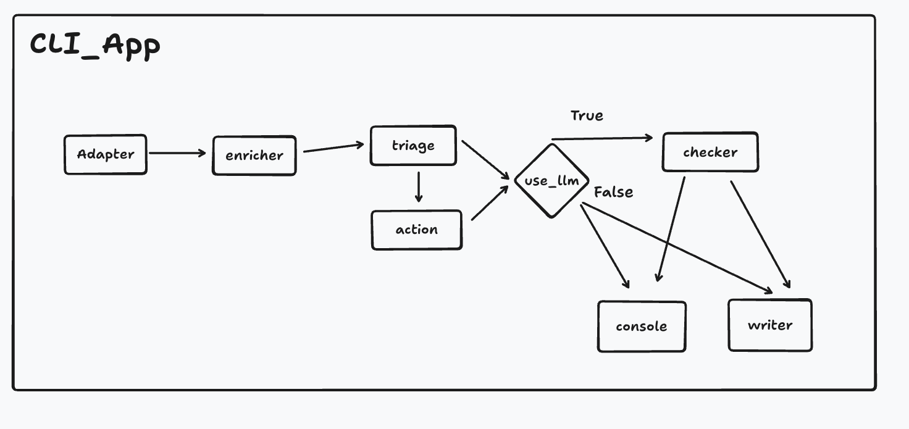

## Description
This is an AI agent for triaging customer support tickets. It uses a dataset from Kaggle: it reads the dataset from a CSV file and runs preprocessing and cleaning to prepare the data for the agent. The triage step then uses a zero-shot NLI model to classify the topics and assign priorities, and based on these, actions are assigned with rules. Ambiguous customer messages are checked with the Qwen LLM, which decides whether they need more clarification. Finally, the results are printed to the console and, at the same time, the whole result is written to a CSV file named `triage_results.csv`.

## Architecture

## Requirements
- A device with 16 GB of RAM is recommended
- The uv project manager; installation instructions: https://pypi.org/project/uv/
- Ollama, to run the open-source LLM; installation instructions: https://ollama.com/download
- qwen3:8b (via Ollama); installation instructions: https://ollama.com/library/qwen3 or `ollama pull qwen3:8b`then make sure to run ollama app with `ollama serve`
- Python >= 3.14
- The Kaggle dataset used by the app, downloaded from the link below and saved at the project level with the name `tickets.csv`: https://www.kaggle.com/datasets/tobiasbueck/multilingual-customer-support-tickets

## Getting Started
First install all the dependencies needed for the agent, run in project level `uv sync`.

To run the AI agent, open a terminal at the project level and run:
`uv run triage -n <number>`, for example `uv run triage -n 200`

Other options for running the CLI app:
- `uv run triage -n <number> --json`, for example `uv run triage -n 200 --json` → displays the result as JSON
- `uv run triage -n <number> --full`, for example `uv run triage -n 200 --full` → displays the whole result
- `uv run triage -n <number> --no-llm`, for example `uv run triage -n 200 --no-llm` → runs without the LLM checker

# Technical Documentation

## A. Problem understanding
- How did you interpret the business problem in an insurance support context?

In the insurance sector, a company can receive a huge number of emails that have to be read and processed manually by humans, which takes a lot of time and effort: understanding the customer's request and forwarding it to the responsible department. A critical problem here is that emails are read in order of arrival (FIFO) rather than by priority. This is bad, because some requests should be escalated and processed immediately; otherwise they can affect the business and damage the reputation of the service.

- Which assumptions did you make about ticket types, urgency, and processes?

Regarding the insurance sector, I assumed requests can be about damage reports (e.g. car accidents), online access issues, service information/prices, creating/updating contracts, and billing. Urgency falls into three levels: low, medium, and high.

## B. Data and preprocessing
- Which part of the dataset did you use, for example language, subset, and fields, and why?

The enricher uses German-language tickets only, based on the assumption that the agent will work with customers who mainly speak German. However, since the language labels in the dataset are not fully correct and we cannot assume the language will always be German (it can also be English), the agent is already made aware of this in the system prompt. We assume that no other languages will be used. The agent processes only the subject and body columns, because they are the only columns that represent the customer's request.

- What preprocessing steps did you apply, and why were they necessary or helpful?

The enricher filters the tickets to German only, to focus on a single language; however, the NLI model and the LLM are multilingual, so mixed languages will not affect the quality of the results. Another step replaces null values in the subject and body with an empty string, to avoid null/NaN values in the text. Symbols and newlines are removed from the body, because they are noise reduction and do not affect the results.

## C. Architecture and tools
- Describe your overall architecture, including main components and their responsibilities.

The overall architecture is a pipeline of components that are called one after the other:
- **Adapter:** reads the dataset from the CSV file located at the project level with the hardcoded name `tickets.csv`.
- **Enricher:** preprocesses and cleans the data and selects the columns used for the subsequent classification.
- **Triage:** uses an open-source NLI model from Hugging Face to classify the customer request into a purpose label and assign one of three priority levels, from low to high.
- **Action:** a rule-based component that decides the action based on the predicted topic and its priority.
- **Checker:** an LLM that checks whether the customer request is ambiguous, based on its understanding of the request, the predicted topic, the priority, and the escalation. This is only possible with an LLM, because understanding human language is essential here. The LLM is instructed via the system prompt on how to decide whether a request is vague and how to deal with it.
- **Writer:** writes the results as rows in a CSV file.

- Which open-source libraries and models did you choose, and why, for example classifier, embeddings, LLM, or orchestration framework?

The agent uses the open-source LLM qwen3:8b (via Ollama).
Reasons / facts about qwen3:8b:
- Open source
- Model size: 8B
- Thinking mode is on by default and can be disabled per request
- Comprehensive improvements across coding, professional work, research, and long-horizon agentic tasks

It also uses an NLI model for classification.
Facts about the NLI model:
- Open source, from Hugging Face: MoritzLaurer/mDeBERTa-v3-base-xnli-multilingual-nli-2mil7
- Multilingual (up to 16 languages)
- Zero-shot classification
- Model size: 0.3B

- How does your triage agent orchestrate the different steps such as topic, urgency, routing, and missing-info check?

The agent uses pipeline orchestration to handle the different steps described above.

## D. Agentic workflow and behavior

- How does the agent behave when information is missing or the ticket is unclear, for example no product or no clear problem?

This step is handled by the checker (LLM). It cannot be implemented with rules, because it requires language understanding and decision-making based on that; this is why an LLM is used here. If the request is vague, the LLM creates follow-up questions and an example answer.

- In which parts of the workflow did you use ML or LLM-based methods, and where did you use rules, if any?

For classification, the agent uses an NLI model, as it is fast and adequate for a simple classification task. When tickets are unclear or missing information, an LLM is used to decide whether they are ambiguous and to create follow-up questions accordingly. For the next actions, rules based on the predicted topic and its priority are used, because no model is needed to understand that, for example, a billing topic should be forwarded to the billing team.

## E. End-to-end testing and evaluation
- How did you test your triage agent end-to-end?
Due to time constraints, the triage agent was tested manually: I read a sample of requests and checked their classification by hand.
With more time, I would combine several types of tests to verify the quality of the agent:
1. Unit tests: test the deterministic components, such as the action and enricher components.
2. Evaluation tests: compare the triage results with a ground-truth sample and measure how accurate the agent is.
3. End-to-end tests: check the full flow of the agent, from reading the dataset to writing the results to the CSV file, to prove that all components are called in the right order and nothing fails.

- Which metrics or signals would you track to know whether the system works well over time?
AI systems differ from classical software, so it is important to track the models' output over time: check that it is always structured correctly so it does not break the next component, evaluate the quality of the classifications and the LLM responses, and check that the LLM does not produce harmful responses for customers.

## F. Limitations and improvements
- What are the main limitations of your current prototype, including technical, data, and quality limitations?

On the technical side, a limitation of this agent is that it uses pure Python without a framework, which means maintainability and scalability can be very difficult; it should be migrated to an orchestration framework (e.g. LangChain).
On the data side, the dataset consists of IT support tickets, not insurance tickets, so it cannot show whether the agent succeeds in triaging insurance data.

- If you had two more weeks, what would you improve or extend, for example better models, richer agent behavior, AWS deployment, or monitoring?

With more time to invest in this agent, I would address several important aspects that were left out because this is a prototype:
1. Migrate the Python agent to LangChain for better structure, readability, scalability, and maintainability.
2a. Test different NLI models and LLMs to see which ones produce better results.
2b. As NLI comparing to Text Classification models perform lower, would fine-tune a model on dataset with labels, for better results.
3. Increase test coverage for a more robust agent.
4. Add logging for better monitoring of long runs.
5. Deploy the agent on AWS and monitor the latency.
6. Change the architecture to email polling instead of reading a CSV dataset.